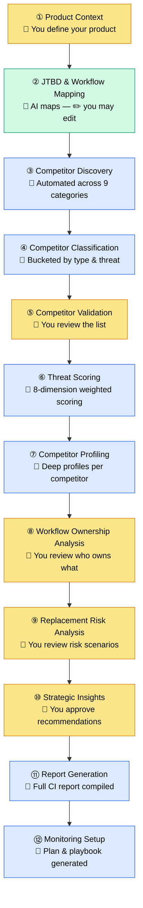

# Competitive Intelligence Agent

**Map your full competitive landscape — including alternatives your customers haven't considered yet.**

A 12-stage, AI-assisted system that surfaces every type of competitor: direct rivals, horizontal platforms, AI agents, outsourced services, internal tools, and more. You stay in control at every critical decision point; the AI handles the research and synthesis.

> Competition is not limited to similar products. It includes platforms, AI agents, workflows, internal tooling, operational redesign, outsourcing, and composite ecosystems.

---

## Prerequisites

- Python 3.9+
- One of:
  - [Claude Code](https://claude.ai/code) installed (no API key needed)
  - An [Anthropic API key](https://console.anthropic.com)

---

## Quickstart

```bash
pip install -r requirements.txt
python main.py --input inputs/example_saas_product.json --auto
```

The backend is auto-detected: `ANTHROPIC_API_KEY` takes priority; falls back to the `claude` CLI if no key is set.

---

## How It Works

The agent runs 12 sequential stages. Stages marked **You** pause for your input or review before continuing. Everything else runs automatically.



**Legend:** 🟡 Human input/approval required · 🟢 AI runs, you may edit · 🔵 Fully automated

---

## Stage Reference

| # | Stage | Mode | What happens |
|---|-------|------|--------------|
| 1 | Product Context Definition | **You (required)** | Describe your product, customers, and core use cases |
| 2 | JTBD & Workflow Mapping | AI + you (optional) | AI maps Jobs To Be Done and end-to-end workflows; edit freely |
| 3 | Competitor Discovery | Automated | AI discovers competitors across all 9 categories |
| 4 | Competitor Classification | Automated | Competitors bucketed by type and preliminary threat level |
| 5 | Competitor Validation | **You (required)** | Accept, edit, or remove competitors before analysis continues |
| 6 | Threat Scoring | Automated | Each competitor scored across 8 weighted dimensions |
| 7 | Competitor Profiling | Automated | Deep profiles generated for every validated competitor |
| 8 | Workflow Ownership Analysis | **You (required)** | Review which competitors own which parts of your workflow |
| 9 | Replacement Risk Analysis | **You (required)** | Review scenarios where customers could replace you entirely |
| 10 | Strategic Insight Generation | **You (required)** | Approve strategic recommendations before the report is built |
| 11 | Report Generation | Automated | Full CI report compiled from all prior stages |
| 12 | Continuous Monitoring Setup | Automated | Monitoring plan and weekly playbook generated |

---

## Setup

### Option A: Claude Code (no API key needed)

```bash
pip install -r requirements.txt
python main.py --input inputs/example_saas_product.json --auto
```

### Option B: Anthropic API key

```bash
pip install -r requirements.txt
export ANTHROPIC_API_KEY=sk-ant-...
python main.py --input inputs/example_saas_product.json --auto
```

---

## Usage

```bash
# Interactive — prompts you for product context at runtime
python main.py

# Load product context from a file (skips Stage 1 prompts)
python main.py --input inputs/example_saas_product.json

# Resume from a specific stage (e.g. after editing an output file)
python main.py --from-stage 5

# Run specific stages only
python main.py --stages 3,4,6

# Skip all optional human review gates (human-required gates still pause)
python main.py --input inputs/example_saas_product.json --auto
```

---

## Competitor Discovery Categories

The agent looks beyond obvious competitors:

| # | Category | Example |
|---|----------|---------|
| 1 | Direct Competitors | Same product, same buyer |
| 2 | Vertical Competitors | Specialized tools for your customer's industry |
| 3 | Generic Horizontal Platforms | Broad tools that could absorb your use case |
| 4 | Adjacent Workflow Tools | Tools that own the step before or after yours |
| 5 | Internal Alternatives | Spreadsheets, custom scripts, homegrown systems |
| 6 | Composite Competitor Stacks | A bundle of tools that together replaces you |
| 7 | AI Agent Alternatives | Agents that automate what your product does |
| 8 | Outsourced Service Alternatives | Agencies or managed services |
| 9 | Manual Process Alternatives | "We just do it by hand" |

---

## Threat Scoring

Each competitor is scored across 8 dimensions. Two carry extra weight:

| Dimension | Weight |
|-----------|--------|
| Problem Overlap | **1.5×** |
| Workflow Ownership | **1.5×** |
| Buyer Overlap | 1× |
| Capability Overlap | 1× |
| AI Capability | 1× |
| Market Presence | 1× |
| Ecosystem Strength | 1× |
| Switching Risk | 1× |

---

## Outputs

All outputs are saved to `outputs/`:

```
outputs/
├── product_context.json          # Enriched product definition
├── jtbd_map.json                 # Jobs To Be Done map
├── workflow_map.json             # End-to-end workflow map
├── capabilities.json             # Capability map
├── competitors_raw.json          # Raw discovery (all categories)
├── competitor_classification.json
├── validated_competitors.json
├── competitor_scores.json        # Threat tiers + scores
├── competitor_profiles/          # Individual profiles (JSON)
├── workflow_analysis.md          # Workflow ownership report
├── capability_matrix.csv         # Capability comparison
├── replacement_risks.md          # Replacement risk analysis
├── strategic_insights.md         # Strategic recommendations
├── final_report.md               # Full CI report
└── monitoring_plan.json          # Monitoring configuration
└── monitoring_playbook.md        # Weekly monitoring guide
```

---

## Example Inputs

See `inputs/` for ready-to-run examples across industries:

| File | Description |
|------|-------------|
| `example_saas_product.json` | Dev tools / project management |
| `example_fintech.json` | Finance operations |
| `example_vertical_saas.json` | Veterinary practice management |

---

## License

MIT
